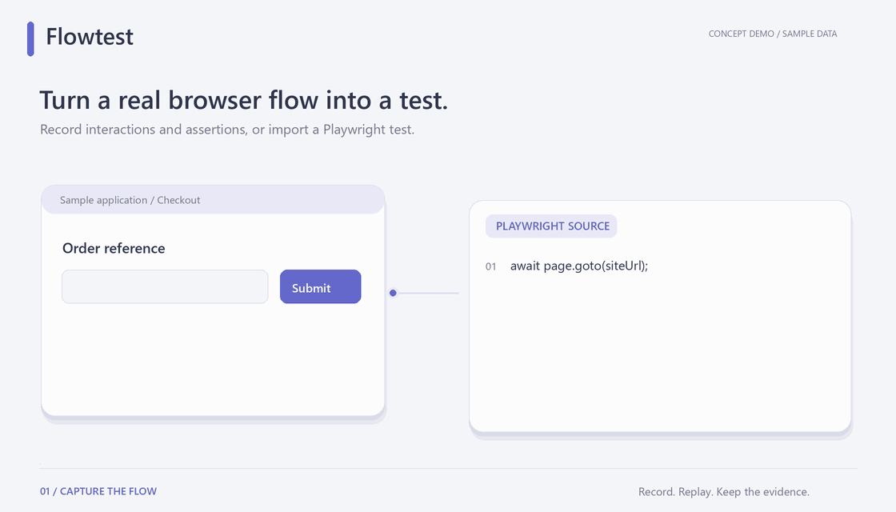
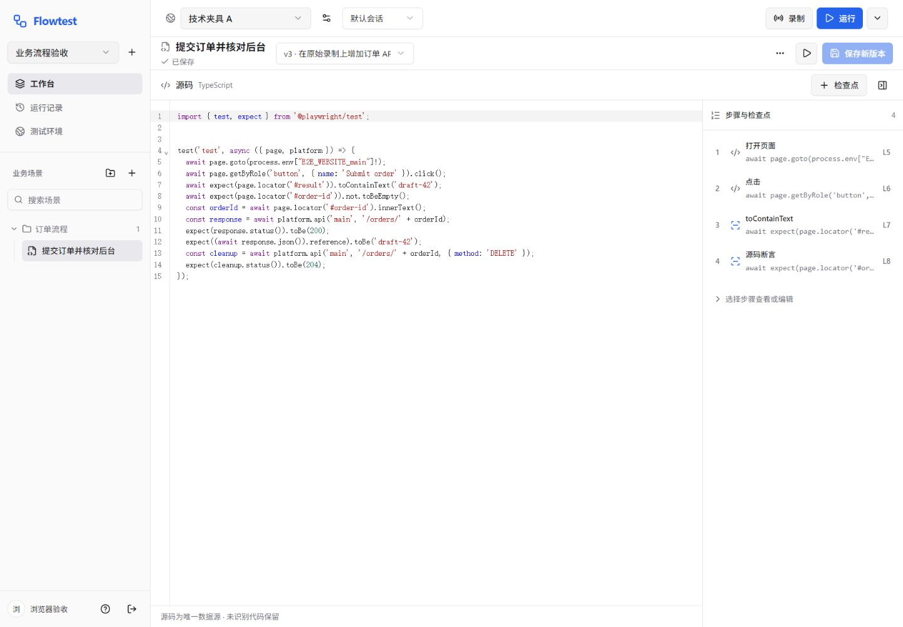

# Flowtest Web 工作台

**录制业务流程，重跑固定版本，把失败定位到具体断言和 Trace。**

The Web workbench for Flowtest: record, edit and replay Playwright workflows with evidence you can inspect.

[简体中文](README.md) · [English](README.en.md)

[](LICENSE)
[](package.json)
[](https://github.com/ShiqinGuo/e2e-test-svc)

[开始使用](#quick-start) · [完整平台](https://github.com/ShiqinGuo/e2e-test-svc) · [技术架构](#architecture) · [反馈问题](https://github.com/ShiqinGuo/e2e-test-fronted/issues)

在一个 Web 工作台里维护场景源码与版本、选择测试环境、执行单场景或测试组，并沿每次尝试查看断言、截图和官方 Trace。适合已有 Web 应用、需要反复验证业务流程的开发者和测试人员。



*程序绘制的功能演绎，使用示例数据，不是实际界面录屏。查看 [静态画面](docs/media/flowtest-poster.png) 或 [动画说明与源码](docs/media/README.md)。*

## 你能直接做什么

| 工作 | 工作台提供的操作 |
| --- | --- |
| 从操作开始 | 打开远程浏览器录制操作和断言，或导入现有 Playwright Test |
| 修改测试 | CodeMirror 源码编辑、检查点辅助、版本差异和未保存草稿保护 |
| 组织测试 | 项目、环境、测试组和场景；单场景或整组执行 |
| 解释结果 | 区分运行状态与验证状态，保留首次失败、重试、跳过和未验证 |
| 回到现场 | 查看原快照、逐尝试证据及私有 Trace；历史重跑创建独立记录 |



*上图为 2026-09-13 本地技术夹具验收截图；[查看运行与断言界面](docs/screenshots/redesign/run-1440.png)。*

<a id="quick-start"></a>
## 开始使用

本仓库是前端，完整使用需要后端、PostgreSQL 和两个 Playwright Docker 镜像。前端不会启动后端或部署被测网站。

| 仓库 | 负责什么 |
| --- | --- |
| [e2e-test-svc](https://github.com/ShiqinGuo/e2e-test-svc) | FastAPI 控制服务、PostgreSQL、Playwright 执行与录制容器 |
| [e2e-test-fronted](https://github.com/ShiqinGuo/e2e-test-fronted) | React Web 工作台：编辑场景、管理环境、查看运行和证据 |

1. 先按 [后端启动指南](https://github.com/ShiqinGuo/e2e-test-svc#quick-start) 准备运行环境并启动 `localhost:4100`。
2. 使用 Node.js 22.12+（已验收环境为 Node.js 24），在另一个终端启动前端：

```sh
git clone https://github.com/ShiqinGuo/e2e-test-fronted.git
cd e2e-test-fronted
npm ci
npm run dev
```

3. 打开 [http://127.0.0.1:5173](http://127.0.0.1:5173)，注册账号，创建项目和测试环境。
4. 创建测试组与场景，录制或导入测试；保存版本后运行，再查看断言和 Trace。

默认 `/api` 的 HTTP 和 WebSocket 代理到 `http://localhost:4100`。更改代理、生产构建和同源反向代理配置见 [开发指南](docs/development.md)。尚无被测网站时可用 [后端订单技术夹具](https://github.com/ShiqinGuo/e2e-test-svc/blob/main/docs/development.md#验证)，它需要单独启动，不是在线演示。

<a id="architecture"></a>
## 技术架构


React / TypeScript / Vite 通过同源 Cookie 会话访问 FastAPI，后端负责项目权限、快照与执行。源码是权威输入；检查点面板只在可以可靠定位时局部修改 AST。源码、事件、断言与工件的具体归属由运行快照及测试/尝试身份确定。

[组件与源码对应](docs/architecture.md) · [后端 API 契约](https://github.com/ShiqinGuo/e2e-test-svc/blob/main/docs/api-contract.md)

## 验证与当前范围

[2026-09-13 验收索引](docs/redesign-verification.md) 记录了 38 项单元测试、15 项浏览器回归及 1440 / 810 / 390px 布局检查。业务回归连接真实 API、PostgreSQL 和运行器；部分基础控件测试使用独立 fixture。远程录制的历史证据另见 [功能验收记录](docs/verification.md)。

当前还没有首个真实业务网站案例；上述结果是本地技术夹具的历史证据，不表示本次发布重新完成所有浏览器和容器验收。[本次发布检查](docs/publishing-verification.md) 单独记录。

没有真实断言时不会仅因操作成功显示完全验证；重试后通过仍保留 `flaky` 和首次失败。未知代码结构保持源码编辑，不编造可视化检查点。

## 开发与贡献

```sh
npm test
npm run build
```

浏览器验收需要完整后端与夹具，命令和说明见 [开发指南](docs/development.md)。提交问题时请附复现步骤、预期/实际结果和脱敏截图；后端执行或录制问题可提交至 [后端 Issues](https://github.com/ShiqinGuo/e2e-test-svc/issues)。

## License

Flowtest 自有代码采用 [MIT](LICENSE)。shadcn/ui、Supabase 示例及其他依赖保留原有许可和署名，见 [第三方 UI 来源与适配](docs/third-party-ui.md)。
