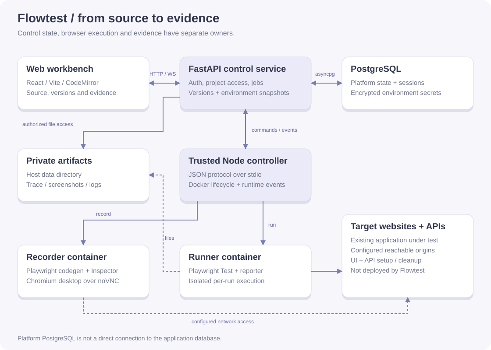

# 技术架构与源码对应

下方历史架构图描述执行链路；当前 Web 协作结构与代码入口以本节表格为准。平台数据库和被测业务数据库是不同概念：Flowtest 当前通过被测 API 校验业务数据，未实现多数据库直连。

| 组件 | 职责 | 源码 |
| --- | --- | --- |
| React Web 工作台 | 源码与检查点、版本、环境和运行证据 | [App](https://github.com/ShiqinGuo/e2e-test-fronted/blob/main/src/App.tsx)、[API client](https://github.com/ShiqinGuo/e2e-test-fronted/blob/main/src/api.ts)、[RunWorkspace](https://github.com/ShiqinGuo/e2e-test-fronted/blob/main/src/runs/RunWorkspace.tsx) |
| FastAPI 控制层 | Cookie 会话、项目授权、录制代理与运行编排 | [main.py](https://github.com/ShiqinGuo/e2e-test-svc/blob/main/app/main.py)、[auth.py](https://github.com/ShiqinGuo/e2e-test-svc/blob/main/app/auth.py)、[jobs.py](https://github.com/ShiqinGuo/e2e-test-svc/blob/main/app/jobs.py) |
| PostgreSQL | 用户与会话、版本、资源、运行及事件等持久状态 | [models.py](https://github.com/ShiqinGuo/e2e-test-svc/blob/main/app/models.py)、[store.py](https://github.com/ShiqinGuo/e2e-test-svc/blob/main/app/store.py) |
| Node 控制器 | 受信任的工具进程，通过 JSON stdio 与 Python 通信 | [runtime.py](https://github.com/ShiqinGuo/e2e-test-svc/blob/main/app/runtime.py)、[bridge.ts](https://github.com/ShiqinGuo/e2e-test-svc/blob/main/runtime/bridge.ts) |
| 录制器 | 独立容器中的 Chromium、官方 codegen / Inspector、noVNC | [recorder.ts](https://github.com/ShiqinGuo/e2e-test-svc/blob/main/src/runtime/recorder.ts)、[recorder runtime](https://github.com/ShiqinGuo/e2e-test-svc/tree/main/runtime/recorder) |
| 运行器 | 执行固化版本，输出逐尝试事件和工件 | [runner.ts](https://github.com/ShiqinGuo/e2e-test-svc/blob/main/src/runtime/runner.ts)、[reporter](https://github.com/ShiqinGuo/e2e-test-svc/blob/main/runtime/runner/reporter.mjs) |

导入的场景代码在 Docker 运行器内执行，不在 API 进程执行。录制器页面、WebSocket、工件和 Trace 入口由 API 校验会话与项目归属；图中连接表示逻辑职责，不能理解为公开的容器端口。

场景版本只新增；创建运行时固化源码、模块与环境。历史重跑复制原始快照并产生新运行，不回写旧记录。断言依据真实 reporter 事件；检查点说明元数据不能证明实际断言执行。首次失败、后续重试、跳过和未验证结果分别保留。

详细契约见 [API contract](https://github.com/ShiqinGuo/e2e-test-svc/blob/main/docs/api-contract.md)，执行与网络边界见 [runner](https://github.com/ShiqinGuo/e2e-test-svc/blob/main/docs/runner.md) 和 [self-hosting](https://github.com/ShiqinGuo/e2e-test-svc/blob/main/docs/self-hosting.md)。

## Web 协作前端边界（2026-09-27）

| 模块 | 职责 |
| --- | --- |
| `src/App.tsx` | Cookie 会话、过期后原账号恢复、邀请入口 |
| `src/app/Application.tsx` | 当前组织／工作区／项目查询与应用导航 |
| `src/app/navigation.ts` | URL 状态、前进后退、页面选择 |
| `src/app/DraftGuard.tsx` | 页面与浏览器导航的草稿保护，异步写入期间阻止离开 |
| `src/organizations` | 角色展示、成员管理、邮箱邀请及接受 |
| `src/workbench` | 项目页面编排、场景列表、执行工具栏、录制对话框 |
| `src/ScenarioPanel.tsx`、`src/editor` | 不可变版本、源码与检查点，支持只读 |
| `src/environments`、`src/runs` | 环境编辑／只读查看及完整执行证据 |

服务端数据统一保存在 React Query 缓存，查询键包含资源作用域；URL保存组织/工作区/项目/场景/运行选择；本地草稿只属于编辑组件。退出登录清空缓存。组织role定时刷新，viewer没有运行或录制控制入口；前端权限提示不替代后端鉴权。组织外资源404，组织内操作权限不足403。

工作区不另设成员表；所有组织成员按统一组织角色访问其中的资源。测试环境的会话角色表示被测网站身份，与平台组织RBAC角色不同。
