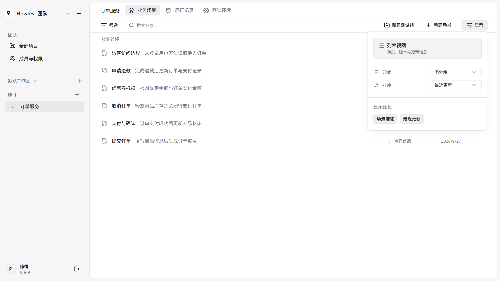

# Web 协作与 Linear 视觉重构验收

2026-09-27。本次重新读取全局和前后端项目 AGENTS.md；前端从单个 App 中拆出应用导航、草稿保护、组织协作、项目编排及执行入口，后端会话同步完成组织/RBAC 重构。

## 视觉验收与纠正

首轮完成了浏览器可用性与响应式验证，但没有充分对照 Linear 原图，不能据此声称视觉达标。用户指出后重新调整了应用结构，保留 [修改前截图](verification/web/visual-before.png)，没有用新截图覆盖这次偏差。

参考为实际查看过的 [Linear 项目列表](https://refero.design/pages/409eadeb-a66b-45ee-a379-88909adabdbb)。[同尺寸对照页](verification/web/linear-comparison.html) 将原图与当前实现并列显示；实现来自 1366×768、deviceScaleFactor=2 的真实浏览器，两张图都是 2732×1536。参考图由原站加载，需要网络。

| 对照项 | 当前实现及检查结果 |
| --- | --- |
| 壳层比例 | 244px 浅灰侧栏、8px 外边距、白色内嵌工作区；组织名直接作为首行入口 |
| 顶部层级 | 项目名与视图切换合并；40px 导航、40px 筛选条、32px 表头，第一行从约 121px 开始 |
| 列表节奏 | 48px 行高，去除逐行边框；名称与描述同行，状态和日期对齐 |
| 控件权重 | 中性色操作按钮，选中视图使用浅灰底；显示面板靠右，与参考保持相近宽度和位置 |
| 显示交互 | 默认不分组；可切换测试组分组、名称/更新时间排序，以及描述/日期属性；筛选、搜索、无结果状态真实生效 |
| 窄屏 | 810px、390px 检查编辑器和导航；390px 列表无页面横向溢出，日期隐藏后版本列标题仍保留 |
| 页面一致性 | 实际查看场景列表、显示面板、成员、编辑、运行证据及移动端截图；统一壳层、文字层级与中性操作色 |

这里复刻的是可见布局、比例和视觉处理。场景编辑、录制、环境与 RBAC 使用本产品的真实业务功能，未添加无实现的看板、时间线或伪造统计。

## 功能与权限

账号可创建组织及默认工作区，通过邮箱绑定邀请加入组织，切换工作区与项目。成员权限为 owner/admin/member/viewer，继承到组织下所有工作区；前端控制操作入口，后端执行最终授权。viewer 可看源码、环境和运行证据，不能编辑或执行。移除成员后旧项目访问失效，最后一名 owner 不能退出或降权。

邀请使用 `/join#token=…`，预览后登录/注册并确认接受；邮箱不符可切换账号，撤销邀请不能接受。源码、环境草稿与运行中操作受统一导航保护，包括浏览器前进后退、刷新及重新认证。

## 已执行检查

本地前端 `127.0.0.1:5173`、后端 `127.0.0.1:4100`，连接真实 PostgreSQL 与 Docker/Chromium 运行器。

| 检查 | 结果与证据 |
| --- | --- |
| TypeScript / Vite 构建 | 通过，[build.log](verification/web/build.log)；保留一个大于 500kB 的运行时分包提示 |
| 单元测试 | 40/40，[unit.log](verification/web/unit.log) |
| 组织与邀请 | 2/2，[visual-e2e.log](verification/web/visual-e2e.log) 中前两项；覆盖多人加入、viewer、工作区隔离、角色变更、移除、最后 owner 和撤销邀请 |
| 视觉调整后业务回归 | 运行证据、列表显示交互、编辑器/草稿保护 3/3，[visual-complete.log](verification/web/visual-complete.log) |
| 最后一次列表校准 | 列表/浮层/属性/窄屏通过，[visual-last.log](verification/web/visual-last.log) |
| 共享控件与分组执行 | 前序完整执行中 12 个共享控件用例和真实分组运行通过，见 [first-e2e.log](verification/web/first-e2e.log)；该轮另有一个失败，未隐藏 |
| 后端 | 对应会话报告真实 PostgreSQL 测试 29/29；本机验收文件 `D:\code\e2e-test-svc\docs\web-rbac-verification.md` 记录迁移、权限、WS 撤权、执行、录制和历史兼容结果 |

这不是一次“全绿”的单次运行。保留失败及修正过程：

1. 导航抽屉打开后 Tooltip 抢占 Escape；改为抽屉自身获取初始焦点。[首次失败](verification/web/first-failure-navigation.md)
2. 环境搜索缺失明确的可访问名称；恢复“搜索环境…”。[搜索失败](verification/web/second-failure-search.md)
3. 视觉调整后默认取消分组，旧测试依赖分组内新增入口；更新为先通过显示面板选择分组。[分组失败](verification/web/visual-failure-grouping.md)
4. Select 退出动画未完成时立即 Escape，被尚未退出的选择层消费；测试等待 listbox 从 DOM 移除，再检查 Escape 关闭显示面板。[浮层失败](verification/web/visual-failure-popover.md)

原始运行与分组证据分别见 [run-acceptance.json](verification/web/run-acceptance.json)、[group-acceptance.json](verification/web/group-acceptance.json)。浏览器用例没有通过前端 mock 代替服务端权限或真实执行。

## 使用范围

### 登录输入框可见性修正

用户后续截图指出空白输入框边界过淡。输入控件改用独立 `--input-border: #8b909a`，不再复用页面分隔线；登录输入框高度 40px，补充占位提示，保留独立聚焦边框与禁用底色。同步修复登录品牌行在壳层重构后的样式遗漏。

实际查看登录默认/聚焦状态和 390px 注册页，无页面横向溢出；构建、40 项单测与 12 项共享控件浏览器回归通过。截图：[登录](screenshots/web/auth-inputs-616.png)、[聚焦](screenshots/web/auth-input-focus-616.png)、[窄屏注册](screenshots/web/auth-register-390.png)。临时测试目录 `test-results-auth-contrast` 删除被自动审批策略拦截，暂时保留。

普通成员通过网页使用，无需安装客户端。部署管理员仍需运行 API、数据库、Docker 运行器和录制服务。当前验证是本地完整链路；尚未发布到公共域名。工作区权限继承组织角色，邀请链接由管理员分享，没有加入邮件发送、SSO 或计费。
